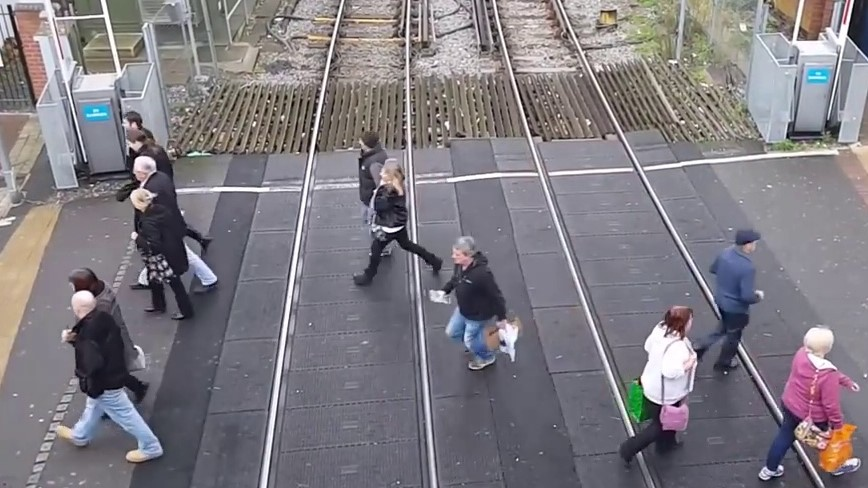
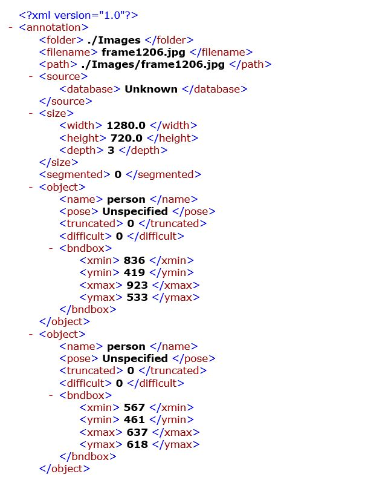
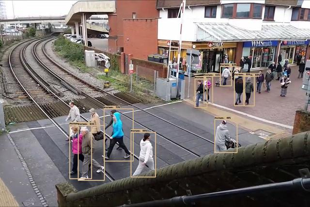
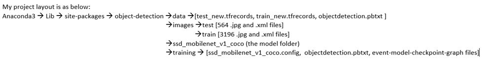
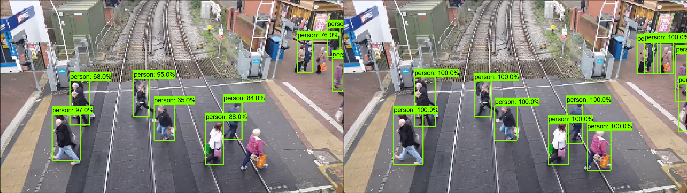

# Object-Detection with pretrained Inception_v2 and Mobilenet model

Problem Description - Detect moving objects at a railway crossover and classify them as human (pedestrian, cyclist or vehicle) and not human. Accordingly trigger/adjust audible alarms (increase volume if human is present, decrease otherwise) at the railway crossover.

**Steps for execution of Object Detection**
**1. Split Video into frames/images.**

The video_to_image.py file helps to achieve this with a framerate of 0.01 (image captured every 0.01sec of the video).

    

**2. Object Detection and Mapping**

I have used the inception-v2 a pretrained model for object detection. The object_detection.py code has functions to detect objects in a frame/image and create an XML file corresponding to each image/frame which contains the class number, class name and dimensions of the detection box around each object in the frame. 

    

Now, Create folders test and train in images as shown in the layout below. Copy 85% of the images into train and 15% into test folders.Past the XML files into the corresponding train and test folder.

    

**3. XML to CSV**

The code xml_to_csv.py code creates a CSV file each for the train and test data present in the train and test data respectively.

**4. TfRecords creation**

The code generate_tf_record.py creates a tfrecord file each for the train and test data present in the train and test data respectively. Copy these tfrecords into the data folder along with a PBTXT which will contain mapping of all the class numbers with the class names. (check the contents of this file in my repo)

**5. Model Training**

Below is a brief layput of the various files required in the different directories before you can execute the model_main.py file.

 

To start training the model, you now need the model and its corresponding config file. I have used the mobilenet_coco model for the training. You can pickup a model and its config from the official tensorflow/models directory in github.

<ins>Paramter changes in config file</ins>

num_classes: 8 #number of classes to detect while training
batch_size: 8 #based on your requirements
fine_tune_checkpoint: "path to the model folder/ssd_mobilenet_v1_coco/model.ckpt"
input_path: "path to the training tfrecord /train/test_label.record" -- in the train_input_reader and eval_input_reader
label_map_path: "path to the pbtxt mapping file /objectdetection.pbtxt" -- in the train_input_reader and eval_input_reader

Execute the model_main.py to start training. Launch TensorBoard to view the performance of training your model through Scalars and Images.

 

***Good Luck! You will come across 100's of errors but do not give up :) ***
***You have Stackoverflow to your rescue***
